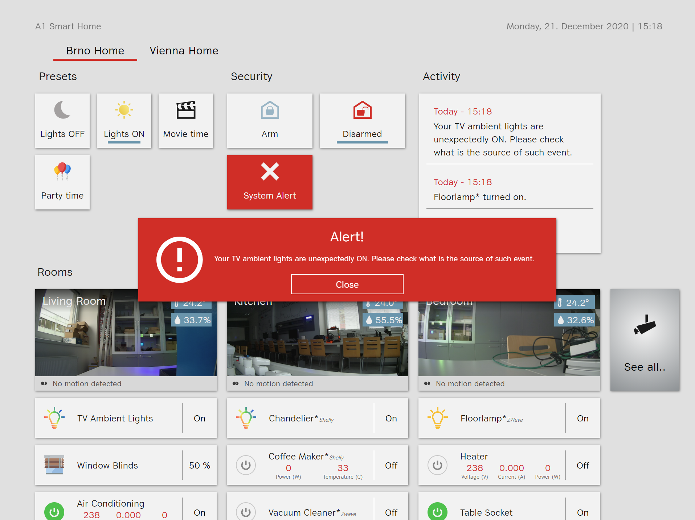

# Builds the MQTT Anomaly Detection Models

This application is used to train or re-train model that is used in Anomaly Detection App.

## Available Scripts
In the project directory, you can run:

### `mvn clean install`
Builds the app for production to the `target` folder. 

### `java -jar mqtt-data-mining-build-model-demo-1.0.0.jar`

Runs the app, the app connects to the `MySQL` database and analyses the stored data so that it creates time series models. Using that the Anomaly Detection App can populate anomaly events.
